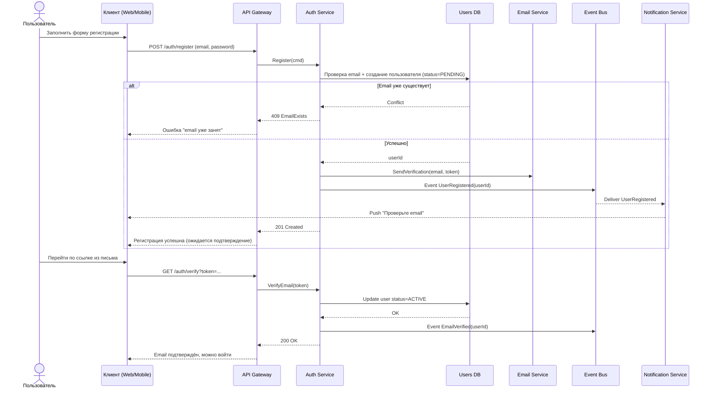
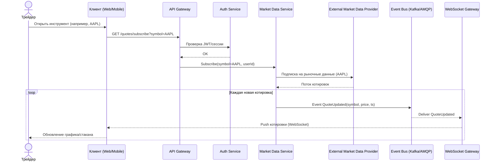
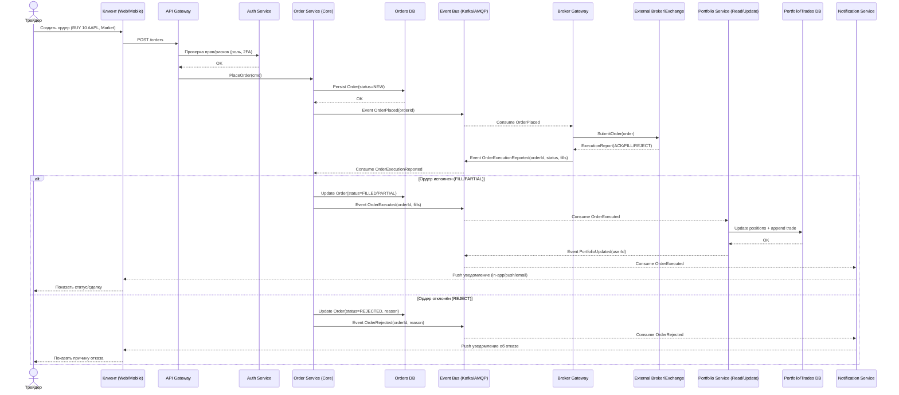
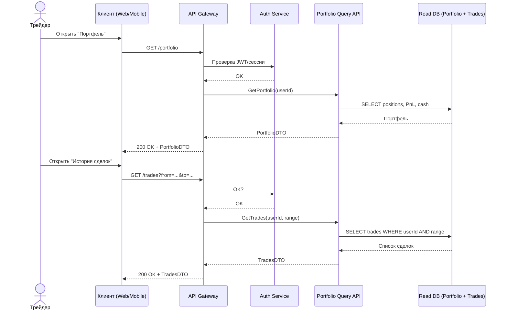
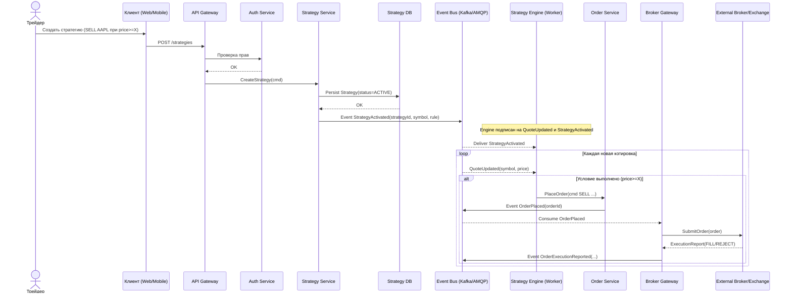
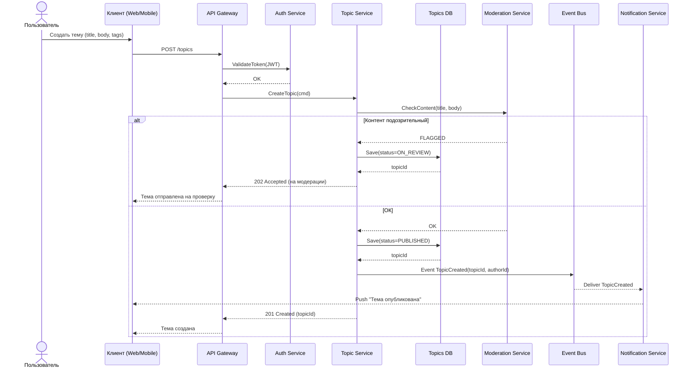
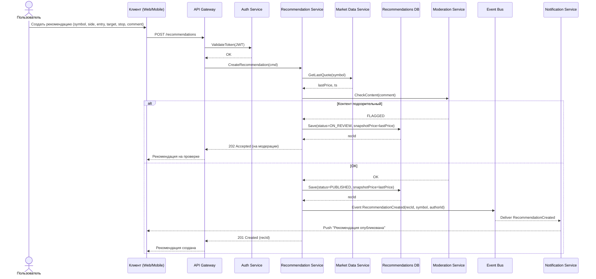

## 1) Регистрация пользователя

## 2) Просмотр котировок в реальном времени

## 3) Создание ордера и исполнение у брокера

## 4) Просмотр портфеля и истории сделок

## 5) Автоматическая стратегия продажи при достижении цены

## 6) Создание темы + модерация

## 7) Создание рекомендации с привязкой инструмента
