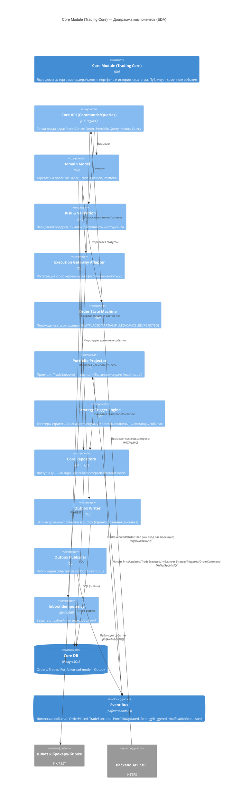

```mermaid
C4Component
title Core Module (Trading Core) — Диаграмма компонентов (EDA)

Container(core, "Core Module (Trading Core)", "Go", "Ядро домена: торговые ордера/сделки, портфель и история, стратегии. Публикует доменные события")

Component(api, "Core API (Commands/Queries)", "HTTP/gRPC", "Точки входа ядра: Place/Cancel Order, Portfolio Query, History Query")
Component(domain, "Domain Model", "Go", "Агрегаты и правила: Order, Trade, Position, Portfolio")
Component(risk, "Risk & Validation", "Go", "Валидация ордеров, лимиты, доступность инструмента")
Component(exec, "Execution Gateway Adapter", "Go", "Интеграция с брокером/биржей (исполнение/статусы)")
Component(state, "Order State Machine", "Go", "Переходы статусов ордера (NEW/PLACED/PARTIAL/FILLED/CANCELED/REJECTED)")
Component(proj, "Portfolio Projector", "Go", "Проекция TradeExecuted → позиции/балансы/история (read-model)")
Component(strategy, "Strategy Trigger Engine", "Go", "Триггеры стратегий (цена достигнута, условия выполнены) → команды/события")
Component(repo, "Core Repository", "Go + SQL", "Доступ к данным ядра: orders/trades/portfolio/read-model")
Component(outbox, "Outbox Writer", "Go", "Запись доменных событий в outbox (гарантированная доставка)")
Component(pub, "Outbox Publisher", "Go", "Публикация событий из outbox в Event Bus")
Component(inbox, "Inbox/Idempotency", "Redis/DB", "Защита от дублей команд/сообщений")

ContainerDb(db, "Core DB", "PostgreSQL", "Orders, Trades, Portfolio(read-model), Outbox")
ContainerQueue(bus, "Event Bus", "Kafka/RabbitMQ", "Доменные события: OrderPlaced, TradeExecuted, PortfolioUpdated, StrategyTriggered, NotificationRequested")

System_Ext(exchange, "Шлюз к брокеру/бирже", "FIX/REST")
System_Ext(bff, "Backend API / BFF", "HTTPS", "Остальные модули системы обращаются к ядру")

Rel(bff, api, "Вызывает команды/запросы", "HTTP/gRPC")

Rel(api, inbox, "Проверка идемпотентности")
Rel(api, risk, "Проверка")
Rel(api, domain, "Вызывает")
Rel(domain, state, "Управляет статусом")
Rel(domain, exec, "Запрос исполнения/отмены")
Rel(exec, exchange, "FIX/REST")

Rel(domain, repo, "Сохраняет/читает состояние")
Rel(repo, db, "SQL")

Rel(domain, outbox, "Формирует доменные события")
Rel(outbox, db, "SQL (outbox)")
Rel(pub, db, "Читает outbox")
Rel(pub, bus, "Публикует события", "Kafka/RabbitMQ")

Rel(bus, proj, "TradeExecuted/OrderFilled (как вход для проекций)", "Kafka/RabbitMQ")
Rel(proj, repo, "Обновляет read-model/историю")
Rel(strategy, bus, "Читает PriceUpdated/TradeExecuted, публикует StrategyTriggered/OrderCommand", "Kafka/RabbitMQ")

```