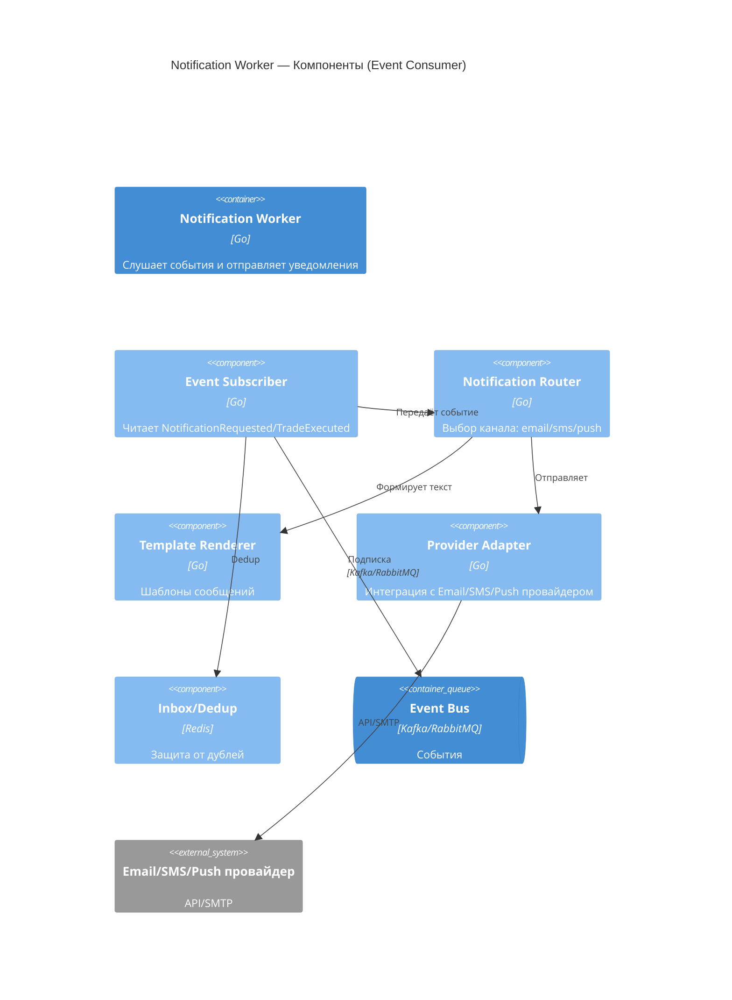

```mermaid
C4Component
title Notification Worker — Компоненты (Event Consumer)

Container(worker, "Notification Worker", "Go", "Слушает события и отправляет уведомления")

Component(sub, "Event Subscriber", "Go", "Читает NotificationRequested/TradeExecuted")
Component(router, "Notification Router", "Go", "Выбор канала: email/sms/push")
Component(tpl, "Template Renderer", "Go", "Шаблоны сообщений")
Component(sender, "Provider Adapter", "Go", "Интеграция с Email/SMS/Push провайдером")
Component(inbox, "Inbox/Dedup", "Redis", "Защита от дублей")

ContainerQueue(bus, "Event Bus", "Kafka/RabbitMQ", "События")
System_Ext(notify, "Email/SMS/Push провайдер", "API/SMTP")

Rel(sub, bus, "Подписка", "Kafka/RabbitMQ")
Rel(sub, inbox, "Dedup")
Rel(sub, router, "Передаёт событие")
Rel(router, tpl, "Формирует текст")
Rel(router, sender, "Отправляет")
Rel(sender, notify, "API/SMTP")

```