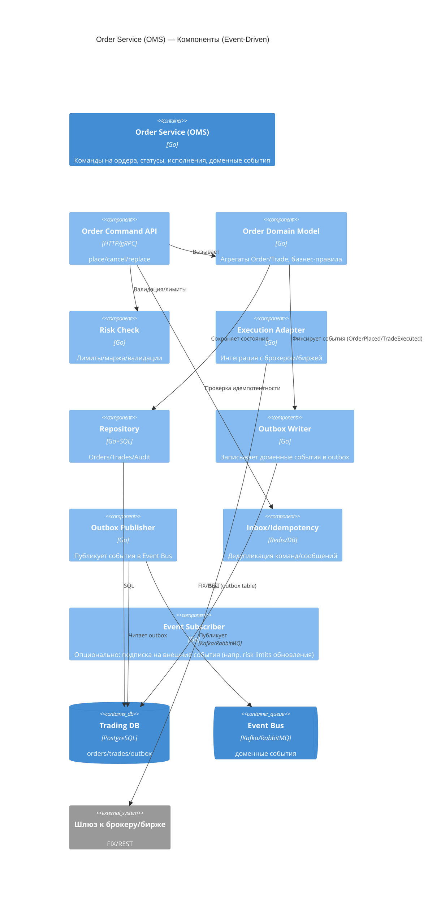

```mermaid
C4Component
title Order Service (OMS) — Компоненты (Event-Driven)

Container(orderSvc, "Order Service (OMS)", "Go", "Команды на ордера, статусы, исполнения, доменные события")

Component(api, "Order Command API", "HTTP/gRPC", "place/cancel/replace")
Component(domain, "Order Domain Model", "Go", "Агрегаты Order/Trade, бизнес-правила")
Component(risk, "Risk Check", "Go", "Лимиты/маржа/валидации")
Component(exec, "Execution Adapter", "Go", "Интеграция с брокером/биржей")
Component(repo, "Repository", "Go+SQL", "Orders/Trades/Audit")
Component(outbox, "Outbox Writer", "Go", "Записывает доменные события в outbox")
Component(pub, "Outbox Publisher", "Go", "Публикует события в Event Bus")
Component(inbox, "Inbox/Idempotency", "Redis/DB", "Дедупликация команд/сообщений")
Component(sub, "Event Subscriber", "Go", "Опционально: подписка на внешние события (напр. risk limits обновления)")

ContainerDb(tradeDb, "Trading DB", "PostgreSQL", "orders/trades/outbox")
ContainerQueue(bus, "Event Bus", "Kafka/RabbitMQ", "доменные события")
System_Ext(exchange, "Шлюз к брокеру/бирже", "FIX/REST")

Rel(api, inbox, "Проверка идемпотентности")
Rel(api, risk, "Валидация/лимиты")
Rel(api, domain, "Вызывает")
Rel(domain, repo, "Сохраняет состояние")
Rel(repo, tradeDb, "SQL")
Rel(domain, outbox, "Фиксирует события (OrderPlaced/TradeExecuted)")
Rel(outbox, tradeDb, "SQL (outbox table)")
Rel(pub, tradeDb, "Читает outbox")
Rel(pub, bus, "Публикует", "Kafka/RabbitMQ")
Rel(exec, exchange, "FIX/REST")

```