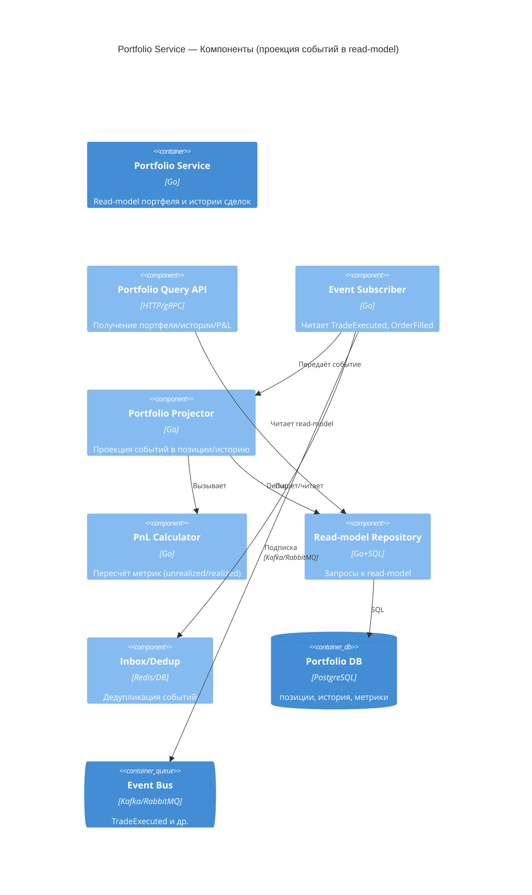

```mermaid
C4Component
title Portfolio Service — Компоненты (проекция событий в read-model)

Container(portfolioSvc, "Portfolio Service", "Go", "Read-model портфеля и истории сделок")

Component(api, "Portfolio Query API", "HTTP/gRPC", "Получение портфеля/истории/P&L")
Component(sub, "Event Subscriber", "Go", "Читает TradeExecuted, OrderFilled")
Component(projector, "Portfolio Projector", "Go", "Проекция событий в позиции/историю")
Component(calc, "PnL Calculator", "Go", "Пересчёт метрик (unrealized/realized)")
Component(repo, "Read-model Repository", "Go+SQL", "Запросы к read-model")
Component(inbox, "Inbox/Dedup", "Redis/DB", "Дедупликация событий")

ContainerDb(portDb, "Portfolio DB", "PostgreSQL", "позиции, история, метрики")
ContainerQueue(bus, "Event Bus", "Kafka/RabbitMQ", "TradeExecuted и др.")

Rel(sub, bus, "Подписка", "Kafka/RabbitMQ")
Rel(sub, inbox, "Dedup")
Rel(sub, projector, "Передаёт событие")
Rel(projector, calc, "Вызывает")
Rel(projector, repo, "Пишет/читает")
Rel(repo, portDb, "SQL")
Rel(api, repo, "Читает read-model")

```