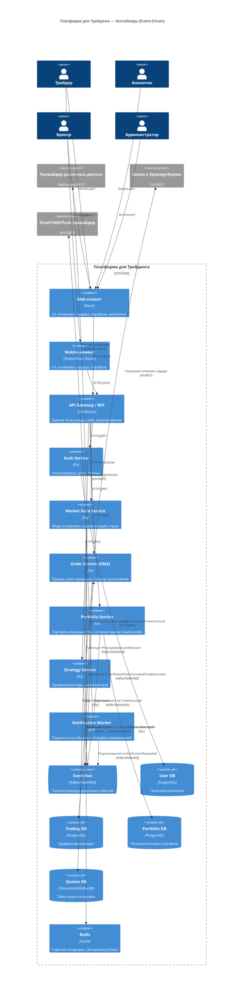

```mermaid
C4Container
title Платформа для Трейдинга — Контейнеры (Event-Driven)

Person(trader, "Трейдер")
Person(analyst, "Аналитик")
Person(broker, "Брокер")
Person(admin, "Администратор")

System_Boundary(s1, "Платформа для Трейдинга") {

  Container(web, "Web-клиент", "React", "UI: котировки, ордера, портфель, аналитика")
  Container(mobile, "Mobile-клиент", "Flutter/React Native", "UI: котировки, ордера, портфель")
  Container(apigw, "API Gateway / BFF", "Go/Node.js", "Единая точка входа, auth, агрегирование")

  Container(auth, "Auth Service", "Go", "Пользователи, роли, токены")
  Container(marketSvc, "Market Data Service", "Go", "Фиды котировок, нормализация, стрим")
  Container(orderSvc, "Order Service (OMS)", "Go", "Ордера, риск-проверки, статусы, исполнения")
  Container(portfolioSvc, "Portfolio Service", "Go", "Портфель/позиции, P&L, история сделок (read-model)")
  Container(strategySvc, "Strategy Service", "Go", "Правила/триггеры, автоторговля")
  Container(notifWorker, "Notification Worker", "Go", "Подписка на события и отправка уведомлений")

  ContainerQueue(bus, "Event Bus", "Kafka/RabbitMQ", "Топики/очереди доменных событий")
  ContainerDb(userDb, "User DB", "PostgreSQL", "Пользователи/роли")
  ContainerDb(tradeDb, "Trading DB", "PostgreSQL", "Ордера/сделки/аудит")
  ContainerDb(portDb, "Portfolio DB", "PostgreSQL", "Позиции/история портфеля")
  ContainerDb(quoteDb, "Quotes DB", "TimescaleDB/InfluxDB", "Тайм-серии котировок")
  Container(cache, "Redis", "Cache", "Горячие котировки, idempotency/inbox")
}

System_Ext(marketData, "Провайдер рыночных данных", "WebSocket/REST")
System_Ext(exchange, "Шлюз к брокеру/бирже", "FIX/REST")
System_Ext(notify, "Email/SMS/Push провайдер", "API/SMTP")

Rel(trader, web, "Использует")
Rel(trader, mobile, "Использует")
Rel(analyst, web, "Использует")
Rel(broker, web, "Использует")
Rel(admin, web, "Использует")

Rel(web, apigw, "HTTPS/JSON")
Rel(mobile, apigw, "HTTPS/JSON")

Rel(apigw, auth, "HTTP/gRPC")
Rel(apigw, marketSvc, "HTTP/WebSocket")
Rel(apigw, orderSvc, "HTTP/gRPC")
Rel(apigw, portfolioSvc, "HTTP/gRPC")
Rel(apigw, strategySvc, "HTTP/gRPC")

Rel(auth, userDb, "SQL")

Rel(marketSvc, marketData, "Получает котировки", "WebSocket/REST")
Rel(marketSvc, quoteDb, "Пишет тайм-серии", "SQL")
Rel(marketSvc, cache, "Обновляет cache", "Redis")
Rel(marketSvc, bus, "Публикует PriceUpdated/CandleClosed", "Kafka/RabbitMQ")

Rel(orderSvc, tradeDb, "SQL")
Rel(orderSvc, exchange, "Размещает/отменяет ордера", "FIX/REST")
Rel(orderSvc, bus, "Публикует OrderPlaced/OrderCanceled/TradeExecuted", "Kafka/RabbitMQ")

Rel(portfolioSvc, bus, "Подписывается на TradeExecuted", "Kafka/RabbitMQ")
Rel(portfolioSvc, portDb, "Хранит read-model", "SQL")

Rel(strategySvc, bus, "Подписывается на PriceUpdated/TradeExecuted", "Kafka/RabbitMQ")
Rel(strategySvc, orderSvc, "Команда на ордер (sync) или OrderCommand (event)", "HTTP/gRPC")

Rel(notifWorker, bus, "Подписывается на NotificationRequested", "Kafka/RabbitMQ")
Rel(notifWorker, notify, "Отправляет уведомления", "API/SMTP")

```