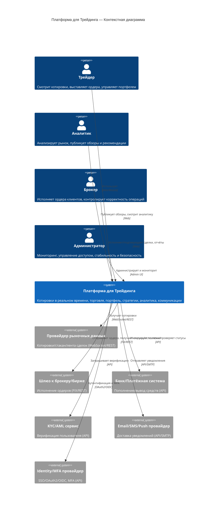

```mermaid
C4Context
title Платформа для Трейдинга — Контекстная диаграмма

Person(trader, "Трейдер", "Смотрит котировки, выставляет ордера, управляет портфелем")
Person(analyst, "Аналитик", "Анализирует рынок, публикует обзоры и рекомендации")
Person(broker, "Брокер", "Исполняет ордера клиентов, контролирует корректность операций")
Person(admin, "Администратор", "Мониторинг, управление доступом, стабильность и безопасность")

System(platform, "Платформа для Трейдинга", "Котировки в реальном времени, торговля, портфель, стратегии, аналитика, коммуникации")

System_Ext(marketData, "Провайдер рыночных данных", "Котировки/стакан/лента сделок (WebSocket/REST)")
System_Ext(exchange, "Шлюз к брокеру/бирже", "Исполнение ордеров (FIX/REST)")
System_Ext(bank, "Банк/Платёжная система", "Пополнение/вывод средств (API)")
System_Ext(kyc, "KYC/AML сервис", "Верификация пользователя (API)")
System_Ext(notify, "Email/SMS/Push провайдер", "Доставка уведомлений (API/SMTP)")
System_Ext(idp, "Identity/MFA провайдер", "SSO/OAuth2/OIDC, MFA (API)")

Rel(trader, platform, "Использует", "Web/Mobile")
Rel(analyst, platform, "Публикует обзоры, смотрит аналитику", "Web")
Rel(broker, platform, "Исполняет/подтверждает сделки, отчёты", "Web")
Rel(admin, platform, "Администрирует и мониторит", "Admin UI")

Rel(platform, marketData, "Получает котировки", "WebSocket/REST")
Rel(platform, exchange, "Отправляет ордера, получает статусы/исполнения", "FIX/REST")
Rel(platform, bank, "Инициирует платежи/проверяет статусы", "API")
Rel(platform, kyc, "Запрашивает верификацию", "API")
Rel(platform, notify, "Отправляет уведомления", "API/SMTP")
Rel(platform, idp, "Аутентификация и MFA", "OAuth2/OIDC")
```