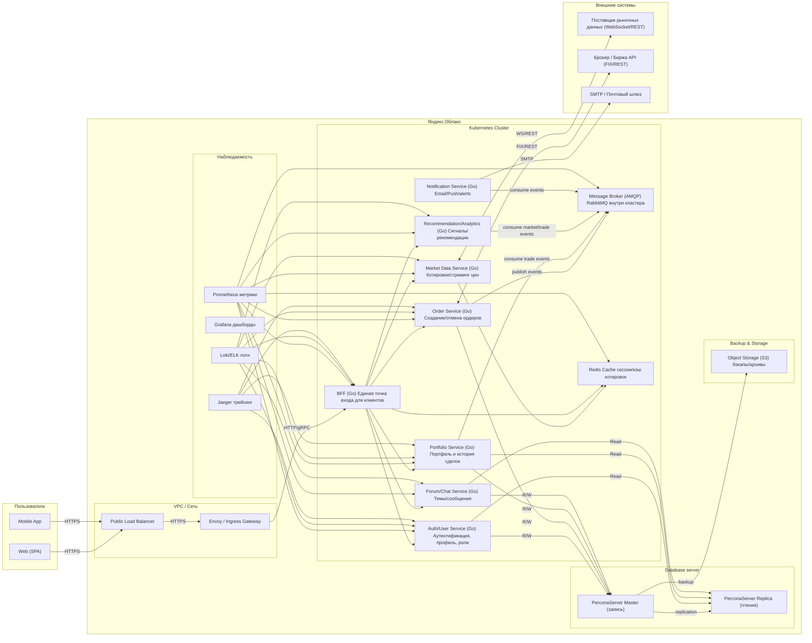
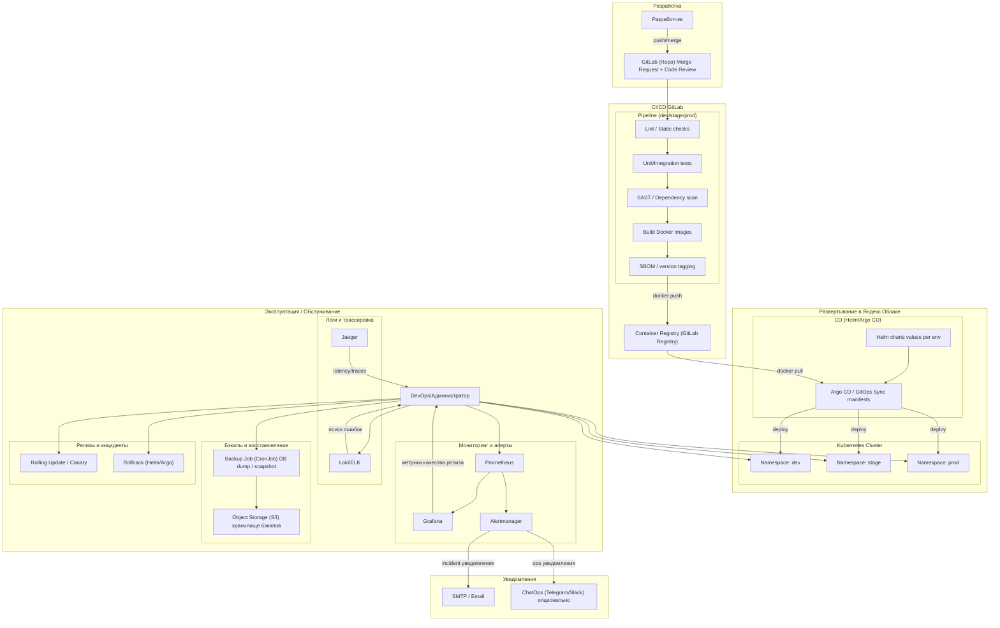

## Infrastructure / Deployment — развертывание

```mermaid
flowchart LR

%% ===== External users =====
subgraph USERS["Пользователи"]
  Web["Web (SPA)"]
  Mobile["Mobile App"]
end

%% ===== Yandex Cloud =====
subgraph YC["Яндекс.Облако"]
  direction LR

  subgraph NET["VPC / Сеть"]
    LB["Public Load Balancer"]
    Envoy["Envoy / Ingress Gateway"]
  end

  subgraph K8S["Kubernetes Cluster"]
    direction LR

    BFF["BFF (Go) Единая точка входа для клиентов"]
    Auth["Auth/User Service (Go) Аутентификация, профиль, роли"]
    Mkt["Market Data Service (Go) Котировки/стриминг цен"]
    Order["Order Service (Go) Создание/отмена ордеров"]
    Portfolio["Portfolio Service (Go) Портфель и история сделок"]
    Reco["Recommendation/Analytics (Go) Сигналы/рекомендации"]
    Chat["Forum/Chat Service (Go) Темы/сообщения"]
    Notif["Notification Service (Go) Email/Push/alerts"]

    Broker["Message Broker (AMQP) RabbitMQ внутри кластера"]
    Cache["Redis Cache сессии/кэш котировок"]
  end

  subgraph DB["Database server"]
    direction TB
    DBM["PerconaServer Master (запись)"]
    DBR["PerconaServer Replica (чтение)"]
    DBM -->|replication| DBR
  end

  subgraph OBS["Наблюдаемость"]
    Prom["Prometheus метрики"]
    Graf["Grafana дашборды"]
    Loki["Loki/ELK логи"]
    Jaeg["Jaeger трейсинг"]
  end

  subgraph BKP["Backup & Storage"]
    S3["Object Storage (S3) бэкапы/архивы"]
  end
end

%% ===== External systems =====
subgraph EXT["Внешние системы"]
  MarketProv["Поставщик рыночных данных (WebSocket/REST)"]
  ExtBroker["Брокер / Биржа API (FIX/REST)"]
  SMTP["SMTP / Почтовый шлюз"]
end

%% ===== Flows =====
Web -->|HTTPS| LB
Mobile -->|HTTPS| LB
LB -->|HTTPS| Envoy
Envoy -->|HTTP/gRPC| BFF

BFF --> Auth
BFF --> Mkt
BFF --> Order
BFF --> Portfolio
BFF --> Reco
BFF --> Chat

%% event-driven
Order -->|publish events| Broker
Portfolio -->|consume trade events| Broker
Reco -->|consume market/trade events| Broker
Notif -->|consume events| Broker

%% data stores
Auth -->|R/W| DBM
Order -->|R/W| DBM
Portfolio -->|R/W| DBM
Chat -->|R/W| DBM

Auth -->|Read| DBR
Portfolio -->|Read| DBR
Chat -->|Read| DBR

Mkt --> Cache
BFF --> Cache

%% external integrations
Mkt <-->|WS/REST| MarketProv
Order <-->|FIX/REST| ExtBroker
Notif -->|SMTP| SMTP

%% Наблюдаемость
Prom --> BFF
Prom --> Auth
Prom --> Mkt
Prom --> Order
Prom --> Portfolio
Prom --> Reco
Prom --> Chat
Prom --> Broker
Prom --> Cache

Loki --> BFF
Loki --> Auth
Loki --> Mkt
Loki --> Order
Loki --> Portfolio
Loki --> Reco
Loki --> Chat

Jaeg --> BFF
Jaeg --> Auth
Jaeg --> Order
Jaeg --> Portfolio

%% backups
DBM -->|backup| S3

```

## Maintenance / Deployment — обслуживание

```mermaid
flowchart TB

%% ==== Development ====
subgraph DEV["Разработка"]
  Dev["Разработчик"]
  Git["GitLab (Repo) Merge Request + Code Review"]
  Dev -->|push/merge| Git
end

%% ==== CI/CD ====
subgraph CICD["CI/CD GitLab"]
  direction TB

  subgraph PIPE["Pipeline (dev/stage/prod)"]
    Lint["Lint / Static checks"]
    Test["Unit/Integration tests"]
    SAST["SAST / Dependency scan"]
    Build["Build Docker images"]
    SBOM["SBOM / version tagging"]
    Lint --> Test --> SAST --> Build --> SBOM
  end

  Registry["Container Registry (GitLab Registry)"]
  SBOM -->|docker push| Registry
end

Git --> Lint

%% ==== Deployment ====
subgraph DEP["Развертывание в Яндекс.Облаке"]
  direction TB

  subgraph CD["CD (Helm/Argo CD)"]
    Helm["Helm charts values per env"]
    Argo["Argo CD / GitOps Sync manifests"]
    Helm --> Argo
  end

  subgraph K8S["Kubernetes Cluster"]
    direction LR
    NSDev["Namespace: dev"]
    NSStage["Namespace: stage"]
    NSProd["Namespace: prod"]
  end

  Argo -->|deploy| NSDev
  Argo -->|deploy| NSStage
  Argo -->|deploy| NSProd
end

Registry -->|docker pull| Argo

%% ==== Operations ====
subgraph OPS["Эксплуатация / Обслуживание"]
  Admin["DevOps/Администратор"]

  subgraph MON["Мониторинг и алерты"]
    Prom["Prometheus"]
    Graf["Grafana"]
    Alert["Alertmanager"]
    Prom --> Graf
    Prom --> Alert
  end

  subgraph LOG["Логи и трассировка"]
    Loki["Loki/ELK"]
    Jaeg["Jaeger"]
  end

  subgraph BKP["Бэкапы и восстановление"]
    DBBackup["Backup Job (CronJob) DB dump / snapshot"]
    Storage["Object Storage (S3) хранилище бэкапов"]
    DBBackup --> Storage
  end

  subgraph REL["Релизы и инциденты"]
    Roll["Rolling Update / Canary"]
    RB["Rollback (Helm/Argo)"]
  end

  Admin --> Prom
  Admin --> Loki
  Admin --> DBBackup
  Admin --> Roll
  Admin --> RB
end

Admin --> NSDev
Admin --> NSStage
Admin --> NSProd

%% ==== Notifications ====
subgraph EXT["Уведомления"]
  Mail["SMTP / Email"]
  ChatOps["ChatOps (Telegram/Slack) опционально"]
end

Alert -->|incident уведомления| Mail
Alert -->|ops уведомления| ChatOps

%% ==== Feedback loop ====
Graf -->|метрики качества релиза| Admin
Loki -->|поиск ошибок| Admin
Jaeg -->|latency/traces| Admin

```